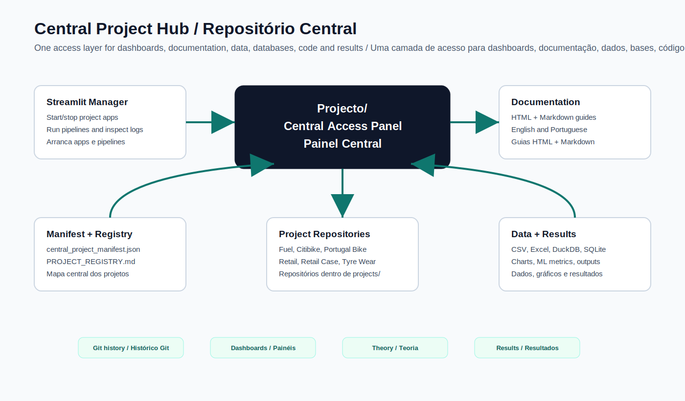
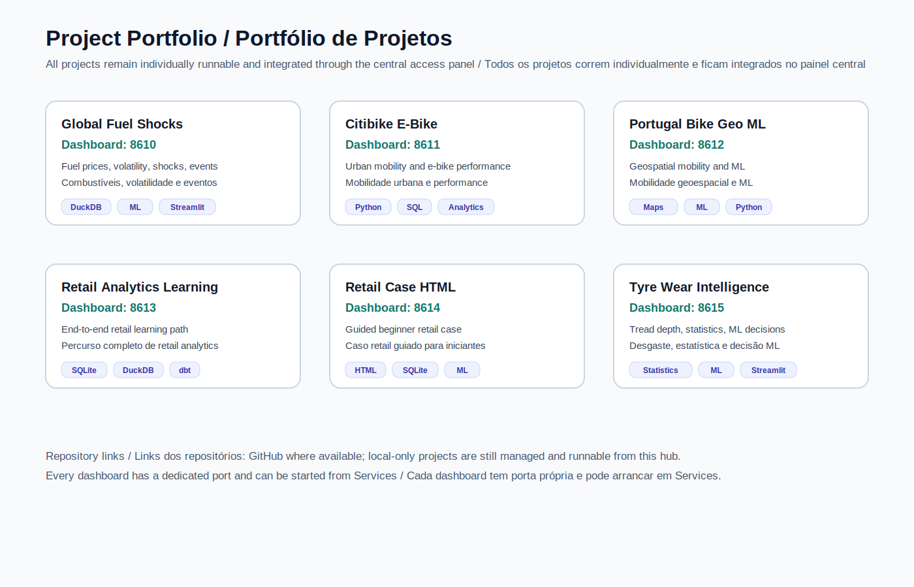
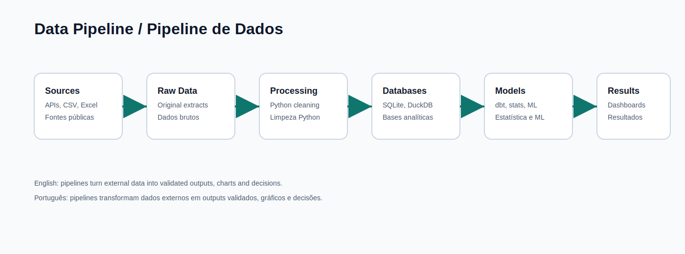
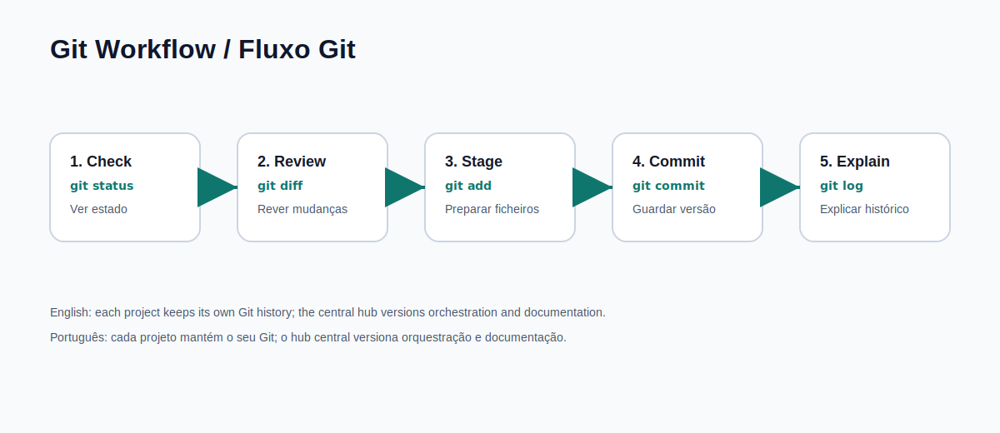
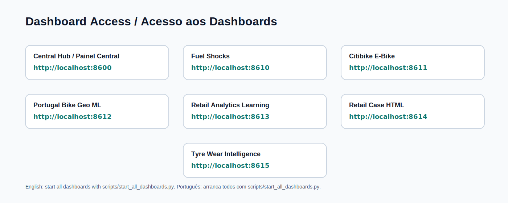

# Guia Visual

Este guia adiciona imagens versionadas ao repositório central para explicar visualmente o portfólio completo.

## Arquitetura Central

## Portfólio de Projetos

## Pipeline de Dados

## Fluxo Git

## Matemática, Estatística e Machine Learning

## Acesso aos Dashboards

